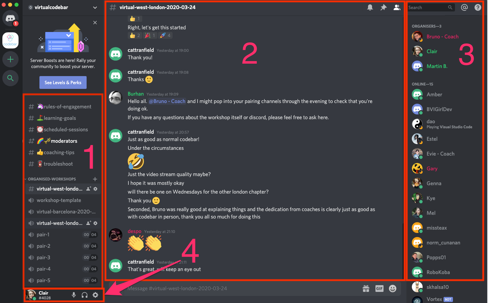
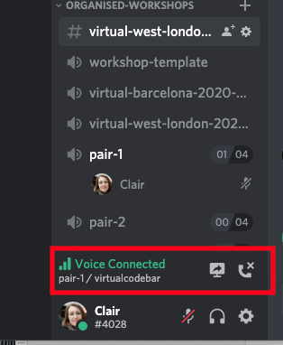
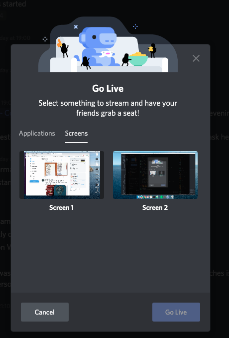
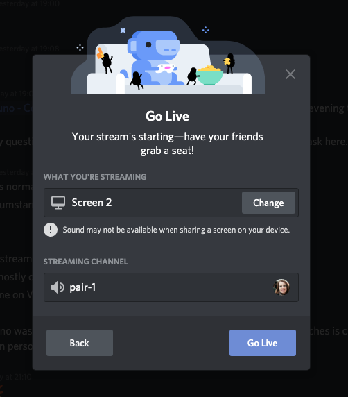
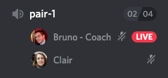
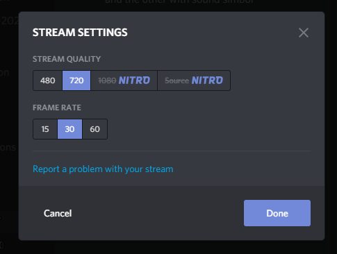

# How to use Discord for codebar

First of all, in case you missed it, you can find the invitation link to codebar's Discord server on your workshop invitation page. It should be available if you have succesfuly managed to secure a spot to the workshop.

After accepting the invitation, we suggest that you [download the Discord desktop app](https://discordapp.com/download). Even though Discord works well in the browser, it does not support video streaming which is an important aspect of the workshops and why you need the desktop client installed on your machine.

When you open the Discord app it should look similar to the screenshot below:

There is LOTS of information, but the most important parts are:
1. List of available channels. Unlike Slack there are 2 types of channel: Text channels (which start with a **#**)  and Voice channels (which start with a :speaker:). All **text channels** are available to you but you need to switch to them to see what has been posted. When it comes to **voice channels** however, you can only be in *one* at a time. We will come back to this in a bit.
2. The text channel you are currently in. As you can see it's also highlithed in the channels list (1).
3. A list of members that are online at the moment. Clicking on one of those will open a Direct Message with that person that no-one else can see.
4. You!

Our Discord server is available to everyone in the codebar community so there may be other people online that aren’t part of the chapter that you normally attend. Most of the channels are public too, so just like Slack, anyone can join in. There is also a small chance that another chapter will be hosting a workshop at the same time but that should have no impact on your workshop experience! Just make sure that you are looking in the workshop related channels mentioned in the section below.

## At the beginning of a workshop

Every virtual workshop will have two channels that you need to join, a text and voice one, and they will be named using the hosting chapter's name followed by the date e.g. a virtual West London workshop taking place on May the first 2020 should be named **virtual-west-london-2020-05-01**. When you join the voice channel, please make sure that **your microphone is muted** and keep it muted unless you need to speak or respond to any queries. Not muting creates a lot of ambient noise and makes it harder for the organisers to be heard.

To **mute** your microphone, click on the microphone icon next to your name:

## Once you’ve been paired

When being paired the organisers will allocate a coach/student for you to work with and the name of a pairing room to use. This will be announced in the workshops **voice channel** so it's important that you join it by the time posted in Slack! To join the pairing voice room you just need to click on the name of the room allocated to you (by doing so you also leave the workshop's voice room so please wait until the intro has finished or otherwise you might miss important announcements).

Once you are in the pairing room, have a chat with your student/coach pair and decide how you would like to proceed. We suggest [continuing to use Discord](#using-the-discord-room-for-pairing) but if you are having trouble or would prefer to use another technology and you are both in agreement, feel free to do that. We would however prefer that you also stay in the Discord pairing channel so that the organisers are able to check up on how you are doing periodically and let you know when the workshop is ending. It's probably best if you mute your microphones to avoid a feedback loop.

## Using the Discord room for pairing

To carry on using the Discord room to pair, the student will need to share their screen. To do this, click on the TV screen that you should now see at the bottom left of the Discord app:

You’ll then be given the option to select what you want to share: a single application or your entire screen:

We would suggest sharing your entire screen, so click on _Screens_ and then pick the one you want to share. Then click _Go Live_.

You should now be prompted with one final message dialog so you can confirm that you have selected the correct stream. Click _Go Live_ and you should now be sharing your screen!

If you are a coach, once your student has started to share their screen, a small red box will appear next to their name with the word _LIVE_

Click on the red box and a final popup dialog will show up with the option to _Join Stream_. Click that and you should be able to see their screen.

If you are the presenter of the stream and more specifically have a slow broadband connection, you can amend the settings of the stream by clicking the _Settings_ icon in the stream overlay:

You will then be presented with a settings window where you can change the quality and frame rate.

## Further questions

If you have any questions throughout the session, feel free to post them in the workshop's text channel or if it's easier for you, pop into the workshop's voice channel. Organisers will be around throughout the session to help you out in any way they can. If you are having discord trouble, you can also direct your questions in the workshop's Slack channel.
