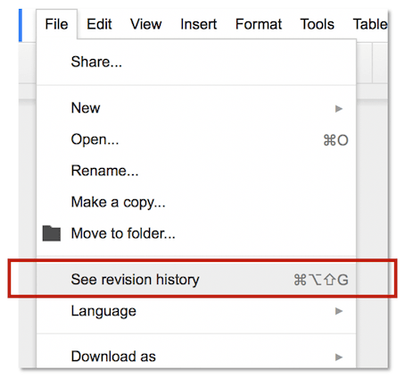
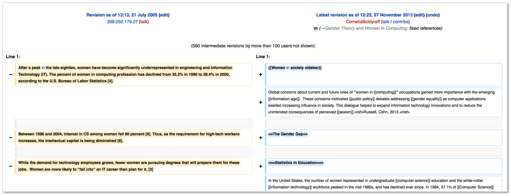

## What is version control?

Version control is a way to manage and track any changes you make to your files. If you've been using online services such as Google Docs or Wikipedia, then you'll already have been working with documents and pages that use a version control system.

### Google Docs revision history

Google Docs, for example, keeps a revision history of any document you create and modify.

Have a look [at this Google document](https://docs.google.com/document/d/10kHJKXHLa-V8G6vVQoDiS6cTPvJoXnj_-SDvfQdziFk/edit?usp=sharing).

- Select to see the revision history (you must be logged in with your Google account to do that!)

- And the more detailed version

Scroll through the revisions, from the bottom up. You should be able to see each set of changes highlighted in green.

### Wikipedia page history

Wikipedia also holds a history of all changes.
- Go to [this document](https://en.wikipedia.org/wiki/Women_in_computing)
- Click **view history**

- Try and have a look at the first revision of the page, by going back. It's dated back to 2005!
- Click **curr**, that will show you the [differences between the first and the latest entry](https://en.wikipedia.org/w/index.php?title=Women_in_computing&diff=583521812&oldid=19298328)

## Why do you need Version Control?

- When used on a regular basis, version control helps you to store your files safely. It makes it easy to figure out what broke your code, as you can roll back to a previous version and work out when things last worked as expected.
    - With no version control in place you'll only have one copy of your file, then when it breaks there's likely no way to get back to working code!

- It is also helpful when working with other people as it combines all the changes together and tracks who, why and when it changed.
    - In the work environment this may be essential to know for example, what issue the change fixes or customer requirement it relates to.

## Code version control systems

There are a number of different version control systems. The most popular ones are **SVN** (or Subversion), **CVS**, **Mercurial** and **Git**. Some are paid for and others are free.

We will be using **Git** with **Github**:

- **Git** is a tool that makes sharing code and collaborating with other developers easy. It also keeps our code tracked and safe.
- **Github** is the web based hosting service for our code repositories that we interact with through the Github web pages.

We'll use Git installed on our system to manage code we work on and then push our code to Github hosted repositories. 

### Why Git and Github?

There are a number of reasons we chose Git and Github, namely;

- Lots of learning resources are publicly available

- Git does not require you to be connected to the internet to use

- All your tracked changes stay on your machine until you are happy with them, and want to make them part of your codebase on Github

- Will tell you if someone has made changes since you last pushed code and urge you to update first and resolve issues

- Github makes online collaboration easy. Open source code is a big part of today's life. By being able to retrieve and help existing projects, you can also contribute to them

### Projects on Github
Once you've worked through the Git and Github tutorials here at Codebar, there are an incredible range of projects that you'll be able to access for free. These projects include operating systems, games, programming languages, books and more.

- Go retro with a **Windows 95** simulation: [https://github.com/felixrieseberg/windows95](https://github.com/felixrieseberg/windows95)

- Learn more with free **Programming Books**: [https://github.com/EbookFoundation/free-programming-books](https://github.com/EbookFoundation/free-programming-books)

- Grab some free **Games** kept on Github: [https://github.com/leereilly/games](https://github.com/leereilly/games)

- Amazing **Android Apps** and learning resources: [https://github.com/Mybridge/amazing-android-apps](https://github.com/Mybridge/amazing-android-apps)

- Ideas for **cool projects** you can build or contribute to [https://github.com/open-source-ideas/open-source-ideas](https://github.com/open-source-ideas/open-source-ideas)

- Grab a copy of an extensive **Git Cheatsheet** for reference [https://github.com/arslanbilal/git-cheat-sheet](https://github.com/arslanbilal/git-cheat-sheet)

To find more projects, just enter a search in Github and see what comes back!

## Key Terms and Definitions for Git

As with any technology and related tool, there's a lot of terminology realted to Git and Github. Here's some of the most common terms and their definitions:

- **Repository**: A repository is where code is stored, it can be a local or remote repository. Also called a 'repo'

- **Clone**: Copy a repository so you can pull it down to your local machine and start editing the code

- **Pull**: Get the latest version of code from a reposity

- **Push**: Send your code changes to the remote repository

- **Add**: Adds your chosen changes to the local Stage area, ready for a commit and push

- **Stage**: An index of changes you are preparing to commit to the repository

- **Status**: Shows the state of the working directory and the Staging area

- **Commit**: Applying any changes you have made into the repository

## Good Practices when Working with Git

### Aim for small and focused changes

When using version control, you should commit every time you do a small piece of work, rather than working for hours in a row, changing too many things and then committing them is a great way to introduce issues that are hard to track down. What's more, it makes it harder to review changes you made and need merging into the current code base.

For example, if you want to change the position of an element, the colour of all the links on your page and the font size dimensions of all paragraphs, you should do three commits, using messages that describe what you are doing each time.

### Write meaningful commit messages

Every time you commit a change use a message that describes your change clearly. In a few months time you will have difficulty remembering why you applied a change if your messages say _changing some CSS_, _another commit_ or _more changes_.

Try using messages such as _repositioned image to look better on page_ or _resolved positioning issue for Firefox_.

### Always check for updates by others
When you come back to coding, be sure to `pull` any changes into your local repository that others may have committed to the repository since you last worked on the code. If there are changes you don't pull in you can get **Merge Conflicts**, where two sets of changes, the ones from other people and yours, need to be worked through to decide which change is kept. Resolving merge conflicts is notoriously tricky - small, frequent commits followed by a pull are a great way to avoid merge conflicts.

## The next step

Get set-up with [Git and GitHub](../set-up/tutorial.html).

-----

This ends our **Introduction to version control with Git** lesson. Is there something you don't understand? Try and go through the provided resources with your coach. If you have any feedback, or can think of ways to improve this tutorial [send us an email](mailto:feedback@codebar.io) and let us know.
