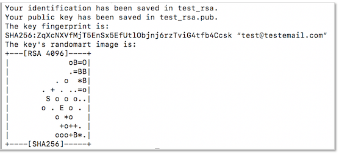
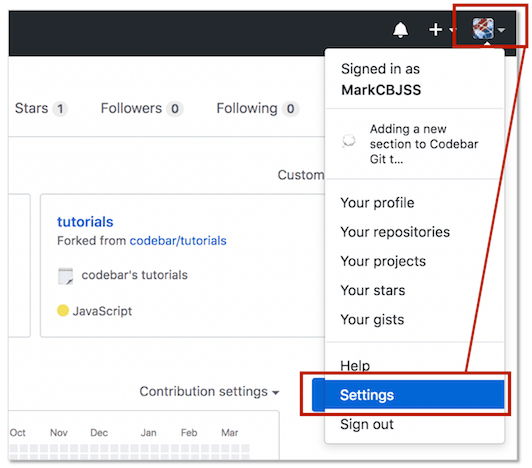
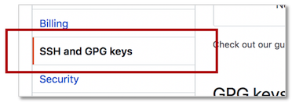
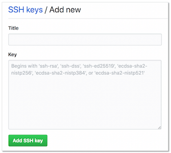

## Introduction to Git and GitHub
-----
Now that we know what Version Control is, let's get set-up with Git and Github. By the end of this tutorial we'll have installed Git, set-up a Github account, created SSH keys that we can use to authenticate between the two, then finally created and cloned a repository for us to start working on our own projects and contributing to others.

## Install and Set-up Git
Install command line Git for your operating system ([OS X](https://sourceforge.net/projects/git-osx-installer/), [Windows](http://msysgit.github.io/) or [Linux](https://git-scm.com/download/linux)) and open a terminal / command prompt.

Once installed check Git commands works by typing the following in the terminal window.

```bash
$ git --version
```
This will return the version of Git you've installed and prove it's up and running correctly.

> Later in the tutorial we'll download [Github Desktop](https://desktop.github.com/).

### Create an empty Git repository
Now create a directory where you will be storing all your projects, by typing the following lines and hitting enter after each. You can call the directory whatever you prefer, such as `code` or `projects`.

```bash
$ mkdir practising-git
$ cd practising-git
$ git init
```

> The first command above will make a new directory (`mkdir`) at the system location you're at within the terminal window. The second command will change directory (`cd`) into the new one you just made. The third command will call the Git program then initialise (`init`) your directory as a local Git repository

### Set-up your Git account details
When we make a commit to a respository we need to associate it with ourselves. To do that we can tell Git our Github account username and email address. Type the following lines in the terminal window.

```bash
$ git config --global user.name "Your Name"
$ git config --global user.email "name@domain"
```

### Set-up a SSH keys
In order to connect to and work with the host of a remote repository you'll need a way to prove who you are before a secure connection is allowed. If you think you may already have SSH keys set-up or just want to see what you have in place, use the following command.

```bash
$ ls -al ~/.ssh
```
> Notice this is a command line statement, not a Git statement.
> In the consoole window look for files named `id_rsa` and `id_rsa_pub`

There are two files to be generated as one is the Private Key that resides on your system and the other is the Public Key that can be shared and added to various services, such as Github, as the other part to authenticate you with.

**# Generate SSH Key Pairs**

Open a terminal window and enter the following command.

```bash
ssh-keygen -t rsa -b 4096 -C "your_email@here.com"
```

When prompted to `Enter file in which to save the key`, just hit `[ENTER]` on your keyboard to accept the location shown. If there are already keys in that location you'll be asked if you want to overwrite them. Hit `y` or `n` as appropriate.

You'll then be asked to `Enter passphrase` and to reconfirm it - choose a secure one - then hit `[ENTER]` after each prompt and the keys will be generated, along with your password and email as a label.



**# Add SSH Keys to the ssh-agent**

To avoid having to provide a password every time we connect to a service we can use the ssh-agent on our system. This agent handles passwords for ssh private keys and connections to the remote service we're logging into. This avoids having to send passwords over the network to the service.

Check if the ssh-agent running by typing the following command

```bash
eval "$(ssh-agent -s)"
```
This should return the PID for the ssh-agent which means it has been started in the background.


Now add the ssh keys to the ssh-agent by typing one of the following depending on your system.
```bash
Windows:  ssh-add ~/.ssh/id_rsa 
    Mac:  ssh-add -K ~/.ssh/id_rsa
```
> The -K option is Apple's version of `ssh-add` which adds the passphrase to your keychain for when you add the key to the ssh-agent

You can check what identities have been added to the ssh-agent by typing:
```bash
ssh-add -l
```

## Set-up and Connect to a Github Account
Now that we have Git working on our local system and the SSH keys we'll need in order to connect to a remote service, let's set-up the Github account so we can then finish connecting the two.

### Sign-up for a Github Account
Navigate to [https://github.com/](https://github.com/) and from the home page sign-up for an account.


Be sure to choose the free pricing plan.


Once you've verified your email address the account will be active and you can go back to edit your profile later on.

### Add the SSH Key to Github

Now we have both Git and the SSH keys set-up on our local system and a Github account created so we can have access to hosted repositories, we need to link them together using the SSH keys.

Navigate back to github.com and ensure you're signed-in to your account. Then in the top right corner click on your profile photo and select `settings`.



In the Settings sidebar, select the `SSH and GPG Keys` option.



On the right hand side, select `New SSH Key` which will present you with an area to paste your public SSH key text into.


We need to copy to the clipboard the contents of the `id_rsa_pub` file we created earlier. In a console window type the following command.
```bash
pbcopy < ~/.ssh/id_rsa.pub
```
Now return back to the broswer where your Github account is open. Give the SSH key a `Title` and paste the file contents into the `Key` field. When done, hit the `Add SSH Key` button. You may be prompted for your password, if so enter it and hit `Confirm Password` to complete this step.



You can check your connection to Github is set-up correctly by typing the following command, which should give you the message in the console window shown below.

```bash
ssh -T git@github.com
```


### Create a Github Repository

Now that we're all set-up, we just need to add a repository on Github that we can add files to once we've crerated them on our local system.


### Clone a Github Respository

One last thing we can do for our set-up is to Clone a remote repository on Github, down to our local system.


This ends our _Set-up Git and GitHub_ lesson. Is there something you don't understand? Try and go through the provided resources with your coach. If you have any feedback or can think of ways to improve this tutorial [send us an email](mailto:feedback@codebar.io) and let us know.